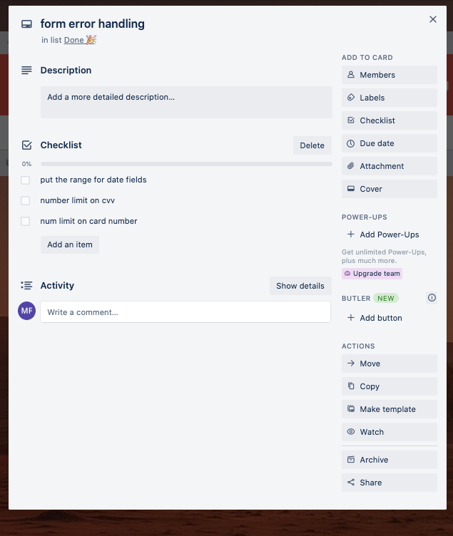
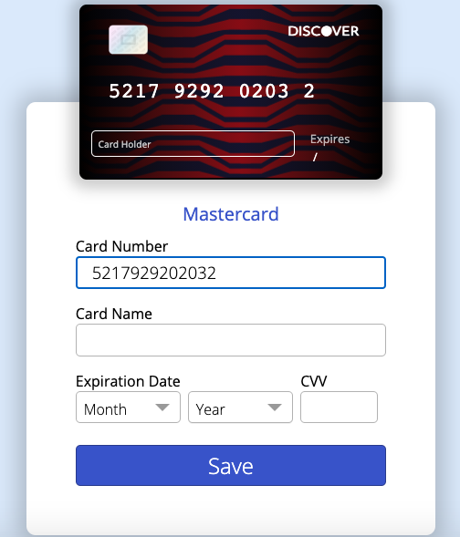

# Card Saver

# Table Of Contents
1. [Links](#Links)
2. [Planning](#Planning)
3. [Tech Stack](#Tech-stack)
4. [Features](#features)

## Links

[**Github**](https://github.com/MeikaFreckelton/credit-card-app)

[**Trello**](https://trello.com/b/G2Dmkeww/credit-card-app)

[**Live Site**](https://card-saver.netlify.app/)

[**Deployed Server**](https://exp-card-server.herokuapp.com/)

## Planning

When planning this application, I decided to use Trello to manage my tasks and workload within the given time. Although this wasn't a very big task, it helped to manage these tasks and get a clear idea of everything needing to be done.

## Tech Stack

- MongoDB as the database to store users information and their cards.

- Mongoose to connect to the database.

- Express and Node.js as the backend technologies.

- React as the front-end framework.

- Heroku for deployment of the backend.

- Netlify for the deployment of the frontend.

- **Packages include:** 

  - **React-dropdown**

    - To simplify process of creating custom dropdowns in React, used within the card form for the month and year fields.

  - **React-router-dom**

    - For routing within React, being able to have the nav on top of each page, and creating links to other routes.

  - **Nodemon**

    - To run the servers and have them restart on every change made, for real time viewing of the application.

  - **History**

    - For simple redirecting from pages.

  - **Axios**

    - For making requests to the database, and retrieving or posting data.

  - **Credit-card-type**

    - Used for detecting the card times on input.

  - **Bcryptjs** 

    - Used for salting and hashing the passwords on input, for privacy and security reasons.

  - **Concurrently**

    - To be able to run the client and backend at the same time.

  - **Cors**

    - Used to handle CORS issues within the Express app.

  - **Dotenv**

    - Used to simplify the process of environment variables.

  - **Express-validator**

    - To validate the incoming data before making a request to the database.

  - **Json-web-token**

    - To implement authorization within the app.

  - **Mongoose-unique-validator**

    - Used when making new database entries, to validate whether a piece of data is unique, depending on whether it is required or not.

    

## Features

- **Card visual:**
  
  - To recreate the cedit card image, I originally attempted to create it using SCSS/CSS only, however I was unsure of how I would recreate the credit card chip, so I made the decision to create the card from scratch as an svg. 
  - Originally I had used [This site](http://www.heropatterns.com/) to generate a CSS pattern, and so when I attempted to make my own pattern, I realised this site had an option to save the pattern as an unstyled svg, I downloaded the file of my chosen pattern and used it to make a custom coloured pattern using Adobe Illustrator. 
  
  
  
  
  
  - I then added a black gradient over the top of the pattern to create some dimension and used this graphic to also create the back of the card.
  
  - I also made the credit card chip using my own pattern and a gradient.

- **Authorisation and Storing Data:**
  - I decided the best way to be able to store users data was to set up a database to be accessed later along with authorization to connect them to their card data.
  - To do this I decided to use MongoDB as the database and JWT to safely implement authorisation in a way I was familiar with.
  - I don't have much solid experience in implementing this but I managed to accomplish it, although I'm not entirely sure if I've used the best practices and I still may need some work in this area.

- **Card input and display:**

  - In accordance to the task guidelines, I implemented the real time display of the card information as it's being typed into the form. 
  - I used the useState hooks and on change events to achieve this.
  - I have prevented non-number characters from being input to the card number field, as well as a 16 digit limit. I also seperated the card numbers on the display for a more realistic effect.

  

  - Using the package 'credit-card-type' I was able to display the card types based on the number input.

  

  - I used the package 'react-dropdown' to implement custom and simple dropdown inputs for the expiry dates.

  

  - I also implemented a number limit and prevented non-number digits from being input in the cvv field.
  - When a user begins inputting their cvv numbers, the card image will flip to the back to be able to show the cvv in real-time.

  

  - When the card is saved, it is added to the database, and the user is redirected to the cards page, showing all of their cards previously saved. However, I encountered a bug yet to be solved, in which the most recent card created does not immediately render when redirected to the cards page after adding that card.

  

  - On the cards page, when a card is clicked it will flip all card to show the back of the cards, I have yet to implement a solution to having only one card flipped at a time.

  

  
